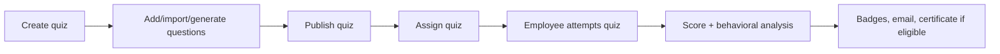
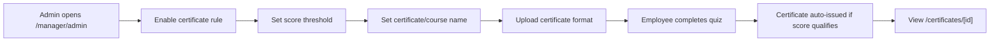

# SkillTest_AI Current Workflow

This document summarizes the current quiz, assignment, certificate, profile, email, and chatbot workflows.

## Quiz Lifecycle



| Step | Owner | Notes |
| --- | --- | --- |
| Create quiz | Manager/trainer/admin | Manual, import, topic AI, or content AI |
| Publish | Manager/trainer/admin | Explicit button, no hidden toggle-only flow |
| Assign | Manager/trainer/admin | Domain search/chips for large employee groups |
| Attempt | Employee | Assigned active quizzes only |
| Results | Employee/admin/trainer | Score, time, points, behavioral metrics |
| Certificate | Admin rules + trigger | Auto-issued when enabled threshold is met |

## Domain Assignment

Employees have a domain/vertical such as:

- Data Engineering
- Java
- C Sharp
- Dotnet
- Mainframe
- Python
- Cloud
- DevOps
- Testing
- Business Analyst
- UI/UX
- General

Assignment UI uses search plus color-coded domain chips so trainers can assign one quiz to a specific vertical quickly.

## Certificate Workflow



Admin can configure each quiz independently:

| Field | Purpose |
| --- | --- |
| Enabled | Turns certificate issuing on/off |
| Minimum score | Any admin-defined threshold, e.g. 70%, 90%, 95% |
| Certificate name | Course/completion name shown to employee |
| Certificate title | Main heading |
| Message | Personalized certificate wording |
| Accent color | Certificate theme color |
| Template upload | Optional image format/background |
| Template notes | Internal reminder or formatting note |

Old attempts are backfilled by running `scripts/031_backfill_old_certificates.sql` after rules are saved.

## Profile Workflow

| Route | Capability |
| --- | --- |
| `/profiles` | Search anyone by name, employee ID, email, role, domain, department |
| `/profiles/[id]` | View profile dashboard, attempts, badges, certificates, attendance, training |
| `/profile/settings` | Upload photo or choose one of 15 default avatars |

## Email Workflow

The app tries SMTP first, then Resend, then console fallback.

| Event | Email |
| --- | --- |
| Quiz assigned | Assignment notification |
| Quiz completed | Score, points, badge count, certificate flag |

SMTP variables:

```env
EMAIL_FROM="SkillTest_AI <your-email@gmail.com>"
SMTP_HOST=smtp.gmail.com
SMTP_PORT=587
SMTP_USER=your-email@gmail.com
SMTP_PASS=your-gmail-app-password
SMTP_SECURE=false
```

## Chatbot Workflow

The manager command chatbot prioritizes true computed stats:

| Example Question | Behavior |
| --- | --- |
| `ashtoush airflow score and analysis` | Finds employee + quiz, returns score and behavioral analysis |
| `average score of rag quiz` | Computes average from completed attempts |
| `certificate eligible employees` | Finds qualifying attempts without certificates |
| `weakest topic` | Computes lowest topic average |

Rules:

- No fake numbers.
- Short responses.
- Deterministic stats first.
- AI only summarizes supplied DB context when deterministic handlers cannot answer.
