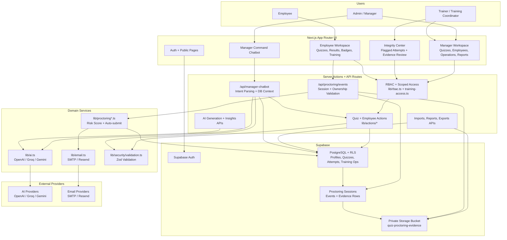

# 🚀 SkillTest_AI: Mavericks Execution Platform

**SkillTest_AI** is an AI-powered Training Management System for enterprise learning teams that need more than quiz screens. It combines training batch execution, employee assessment, attendance governance, trainer workflows, AI coaching, gamification, reporting, and BRD-ready evidence packs in one production-style Next.js platform.

The application is designed for **admins, managers, training coordinators, trainers, and employees**. It supports the full journey from candidate onboarding to quiz assignment, training attendance, assessment upload, project evaluation, feedback collection, leaderboard scoring, and downloadable compliance reports.

---

## 📌 Table Of Contents

| Section | What It Covers |
|---|---|
| [Product Snapshot](#-product-snapshot) | What the app is and who uses it |
| [Core Features](#-core-features) | End-to-end capabilities |
| [Roles And Permissions](#-roles-and-permissions) | Admin, manager, trainer, employee access |
| [Tech Stack](#-tech-stack) | Framework, database, AI, UI, exports |
| [Architecture](#-architecture) | Folder structure and backend flow |
| [Setup](#-setup) | Local install, env, Supabase setup |
| [Database Migrations](#-database-migrations) | SQL execution order and latest migration |
| [Key Pages](#-key-pages) | Frontend routes by role |
| [API Reference](#-api-reference) | Main API endpoints |
| [AI Features](#-ai-features) | AI generation, insights, recommendations |
| [Reports And Exports](#-reports-and-exports) | Excel/PDF outputs |
| [Testing](#-testing-and-verification) | Lint, build, smoke checks |
| [Deployment](#-deployment) | Vercel and production notes |
| [Troubleshooting](#-troubleshooting) | Common setup/runtime issues |

---

## 🧭 Product Snapshot

| Item | Details |
|---|---|
| Product Name | SkillTest_AI: Mavericks Execution Platform |
| Category | Training Management System + AI Assessment Platform |
| Primary Users | Admins, managers, training coordinators, trainers, employees |
| Main Value | Runs training operations and proves execution quality with reports, audit trails, and AI insights |
| Deployment Target | Vercel-compatible Next.js app |
| Database/Auth | Supabase PostgreSQL, Supabase Auth, Row-Level Security |
| AI Providers | OpenAI first, Groq fallback, Google Gemini fallback |

### 🎯 Use Cases

| Use Case | How SkillTest_AI Helps |
|---|---|
| Employee onboarding | Import employees, group by domain, assign quizzes and batches |
| Skill assessment | Create quizzes manually, from Excel, from topics, or from uploaded content |
| Training execution | Create batches, schedule sessions, assign trainers, track attendance |
| Governance | Enforce attendance cutoffs, late reasons, upload audits, batch status evidence |
| Trainer operations | Provide trainer-scoped workflows for attendance, scores, and evaluations |
| Learner engagement | Gamified dashboard, points, streaks, badges, leaderboards |
| Reporting | Download Excel/PDF reports for attendance, assessment, feedback, toppers, and BRD evidence |
| AI coaching | Generate questions, manager insights, employee learning tips, and assessment chat |
| AI proctoring | Enable per-quiz camera/fullscreen integrity checks with private evidence and staff review |

---

## ✨ Core Features

| Feature | Description |
|---|---|
| 🤖 AI Quiz Generation | Generate MCQs from a topic or extracted CSV/XLSX/DOCX/PDF/XML/JSON content |
| 🛡️ AI Proctoring | Optional per-quiz camera/microphone pre-checks, fullscreen enforcement, live violation events, auto-submit, private evidence storage, and staff review |
| 🧠 AI Manager Insights | Short coaching recommendations for batch health, attendance, trainer performance, and quiz outcomes |
| 🎓 AI Learner Coach | Personalized recommendations based on streaks, quiz history, readiness, and retention signals |
| 📊 Assessment Analyzer | Upload assessment results and chat with AI about scores, weak areas, and remediation |
| 🧑‍💼 Profile Dashboards | Search anyone by name, email, employee ID, domain, or role and view quiz, badge, certificate, attendance, and training history |
| 🖼️ Profile Photos | Users can upload a small profile photo or choose from 15 built-in Three.js 3D emoji-style avatar presets |
| 🧭 Smart Domain Assignment | Filter large employee lists by vertical/domain with color-coded chips before assigning quizzes |
| 🏅 Certificates | Admin-only certificate automation with flexible score thresholds, uploaded image templates, personalized employee/course names, stronger visual preview, and automatic issuing |
| 🎖️ Badge Universe | 250+ styled badges across 12+ categories with color, rarity, and shape metadata |
| ✉️ Email Automation | Assignment and completion emails through SMTP or Resend, including score, badge, and certificate updates |
| 🤖 Manager Command Chatbot | DB-aware command chatbot that answers true stats and creates structured quizzes from natural-language commands instead of saving raw prompts as titles |
| 🧑‍🏫 Training Operations | Simplified batch creation, trainer assignment, sessions, attendance, assessments, feedback, reports |
| ✅ Attendance Governance | Cutoff enforcement, late reason capture, version history, bulk import |
| 📥 Import Workflows | Employee imports, quiz-question imports, batch candidate imports, attendance imports, assessment score imports, and analyzer uploads support CSV, XLSX/XLS, DOCX, PDF, XML, and JSON where upload parsing is used |
| 🏆 Accomplishments | Harder-earned badges, employee certificate access, downloadable certificates, live leaderboards, cumulative reports |
| 📄 Reports | Excel and PDF exports for training operations, employees, attendance, assessments, feedback, toppers |
| 🔐 RBAC | Admin, manager, training coordinator, trainer, and employee access boundaries |
| 📬 Notifications | In-app and email notification workflows through SMTP or Resend |
| 🧾 BRD Evidence Pack | `/manager/compliance` plus downloadable evidence workbook for judge/client review |

---

## 📥 Upload And Extraction Support

| Upload Area | Supported Formats | Notes |
|---|---|---|
| Quiz question import | CSV, XLSX/XLS, XML, JSON, DOCX, PDF | Structured files import directly; DOCX/PDF content is extracted for AI question generation or parsed when it contains table-like text |
| Employee import | CSV, XLSX/XLS, XML, JSON, DOCX, PDF | Reads email, name, domain/vertical, and employee ID from flexible headers |
| Attendance upload | CSV, XLSX/XLS, XML, JSON, DOCX, PDF | Supports email or employee ID plus attendance status |
| Batch candidate upload | CSV, XLSX/XLS, XML, JSON, DOCX, PDF | Maps employee/candidate rows into training batches |
| Assessment score upload/analyzer | CSV, XLSX/XLS, XML, JSON, DOCX, PDF | Validates score ranges, candidates, duplicates, and batch membership |
| AI content extraction | CSV, XLSX/XLS, XML, JSON, DOCX, PDF | `/api/extract-content` converts supported files into clean text for AI |

> OCR note: PDF and DOCX extraction works best when the document has selectable text. Image-only scanned PDFs should be OCR-processed before upload, or the app will return a clear “too short / scanned PDF” message instead of guessing.

---

## 👥 Roles And Permissions

| Role | Primary Access | Capabilities |
|---|---|---|
| 👑 Admin | Full platform | User governance, trainer approval, all employee visibility, settings, reports |
| 🧑‍💼 Manager | Manager workspace | Quizzes, employees in scope, batches, reports, dashboards, AI analytics |
| 🗂️ Training Coordinator | Training operations | Batch execution, attendance, score uploads, feedback windows, reports |
| 🧑‍🏫 Trainer | Assigned training batches | Mark attendance, upload assessment scores, submit project evaluations |
| 🧑‍🎓 Employee | Learner workspace | Take assigned quizzes, view training, submit feedback, track leaderboard/badges |

### 🔐 Access Rules

| Area | Access Model |
|---|---|
| Manager pages | `admin`, `manager`, `training_coordinator`, and `trainer` where appropriate |
| Admin console | `admin` only |
| Trainer actions | Scoped to assigned batches |
| Employee quizzes | Only assigned and active quizzes |
| Proctoring evidence | Employees cannot read normalized evidence; training staff/admins review private signed evidence URLs |
| Employee exports | Admin sees all; non-admin training staff are domain-scoped |
| Reports | Manager/training staff with route-level checks and scoped queries |

---

## 🧰 Tech Stack

| Layer | Technology |
|---|---|
| Framework | Next.js 16 App Router |
| Runtime | Node.js 20.9+ recommended |
| Language | TypeScript, TSX |
| UI | React 19, Tailwind CSS 4, shadcn/Radix-style components |
| Auth | Supabase Auth |
| Database | Supabase PostgreSQL with Row-Level Security |
| AI | OpenAI Chat Completions, Groq OpenAI-compatible fallback, Google Gemini fallback |
| Email | SMTP via Nodemailer or Resend |
| Excel | SheetJS `xlsx` |
| PDF | `jspdf`, `jspdf-autotable` |
| Charts | Recharts |
| Browser Testing | Playwright |
| Deployment | Vercel |

---

## 🏗️ Architecture

The codebase uses Next.js App Router with server components, server actions, and API route handlers. New backend work should follow the documented layered flow:

```text
route.ts -> controller -> service -> repository -> database
```

### System Architecture Diagram



### Key Runtime Flows

| Flow | Path |
|---|---|
| Quiz creation | Manager UI or chatbot -> validation -> quiz actions -> Supabase quizzes/questions |
| Chatbot quiz creation | Natural command -> intent extraction -> question generation -> quiz insert -> employee/team assignment |
| Proctored quiz start | Employee pre-check -> `startQuizAttempt()` -> `proctoring_sessions` |
| Violation logging | Browser signal -> `/api/proctoring/events` -> risk summary -> normalized event/evidence rows |
| Auto-submit review | 3-strike/critical risk -> flagged attempt -> email alert -> `/manager/integrity` |
| Evidence access | Staff dashboard -> short-lived signed URL -> private Supabase storage |
| Reporting/imports | Manager APIs -> scoped database reads/writes -> Excel/PDF output |

### 📁 Folder Map

| Path | Purpose |
|---|---|
| `app/` | Pages, layouts, API route handlers |
| `app/auth/` | Login, signup, password reset, callback |
| `app/manager/` | Manager/admin/trainer screens |
| `app/employee/` | Learner dashboard, quizzes, training, badges |
| `app/api/` | API adapters for AI, exports, imports, reports |
| `components/ui/` | Shared UI primitives |
| `components/manager/` | Manager/training operation components |
| `components/employee/` | Learner widgets |
| `components/landing/` | Public landing page sections |
| `lib/actions/` | Server actions for auth, quiz, manager, employee, training |
| `lib/backend/controllers/` | API request orchestration |
| `lib/backend/services/` | Business logic and report generation |
| `lib/backend/repositories/` | Database query modules |
| `lib/backend/entities/` | Backend domain types |
| `lib/supabase/` | Supabase client factories |
| `lib/security/` | Env validation, input validation, rate-limit utilities |
| `scripts/` | Supabase migrations, seed scripts, fixtures, smoke checks |
| `public/templates/` | CSV/XLSX import templates |

### 🧩 Important Backend Modules

| File | Responsibility |
|---|---|
| `lib/rbac.ts` | Central role checks and redirects |
| `lib/training-access.ts` | Batch-level access checks |
| `lib/ai.ts` | Shared OpenAI/Groq/Gemini utility |
| `lib/topper.ts` | Topper score calculations |
| `lib/leaderboard.ts` | Leaderboard aggregation |
| `lib/email.ts` | SMTP/Resend email helpers |
| `lib/proctoring.ts` | Proctoring risk weights, risk levels, and auto-submit threshold logic |
| `lib/proctoring-server.ts` | Server-side proctoring session validation, event recording, private evidence storage |
| `lib/security/env.ts` | Runtime environment validation |
| `lib/security/validation.ts` | Zod schemas for user input |

---

## ⚙️ Setup

### ✅ Prerequisites

| Requirement | Version / Notes |
|---|---|
| Node.js | 20.9+ recommended |
| npm | Included with Node |
| Supabase | Project URL, anon key, service role key |
| OpenAI, Groq, or Gemini | Optional but required for external AI features |
| SMTP account or Resend | Optional but required for email delivery |
| Git | Required for pushing changes |

### 📦 Install

```bash
npm install
```

### ▶️ Run Locally

```bash
npm run dev
```

Open:

```text
http://localhost:3000
```

### 🧪 Useful Commands

| Command | Purpose |
|---|---|
| `npm run dev` | Start local development server |
| `npm run build` | Production build and TypeScript check |
| `npm run lint` | ESLint check |
| `npm run start` | Start built production app |
| `npm run test:smoke` | Playwright smoke test |
| `npm run fixtures:contest` | Generate contest/demo CSV fixtures |
| `npm run fixtures:tms` | Generate large TMS upload fixtures |
| `npm run test:scale` | Generate and validate 20,000-row import fixtures |

---

## 🔑 Environment Variables

Create `.env.local` in the project root.

| Variable | Required | Purpose |
|---|---:|---|
| `NEXT_PUBLIC_SUPABASE_URL` | Yes | Supabase project URL |
| `NEXT_PUBLIC_SUPABASE_ANON_KEY` | Yes | Supabase anon/public key |
| `SUPABASE_SERVICE_ROLE_KEY` | Yes | Server-side admin operations |
| `NEXT_PUBLIC_APP_URL` | Recommended | Local/site URL for redirects |
| `NEXT_PUBLIC_SITE_URL` | Optional | Alternate site URL |
| `NEXT_PUBLIC_DEV_SUPABASE_REDIRECT_URL` | Optional | Local auth callback override |
| `OPENAI_API_KEY` | Optional | Primary AI provider |
| `GROQ_API_KEY` | Optional | Fast AI fallback provider |
| `GROQ_MODEL` | Optional | Groq model override, defaults to `llama-3.3-70b-versatile` |
| `GOOGLE_GEMINI_API_KEY` | Optional | Fallback AI provider |
| `SMTP_HOST` | Optional | SMTP host for free email sending, e.g. Gmail SMTP |
| `SMTP_PORT` | Optional | SMTP port, usually `587` |
| `SMTP_USER` | Optional | SMTP username/email |
| `SMTP_PASS` | Optional | SMTP app password |
| `SMTP_SECURE` | Optional | Set `true` for port `465`, otherwise `false` |
| `RESEND_API_KEY` | Optional | Email sending |
| `EMAIL_FROM` | Optional | Sender identity for Resend |
| `CRON_SECRET` | Production | Protects governance cron endpoint |
| `SEED_ADMIN_PASSWORD` | Seed only | Password for seeded admin user |
| `SEED_TRAINER_PASSWORD` | Seed only | Password for seeded trainer user |
| `ALLOW_DEMO_SEED_CREDENTIALS` | Local only | Set `1` only for throwaway demos |

Example:

```env
NEXT_PUBLIC_SUPABASE_URL=https://your-project-id.supabase.co
NEXT_PUBLIC_SUPABASE_ANON_KEY=your-anon-key
SUPABASE_SERVICE_ROLE_KEY=your-service-role-key
NEXT_PUBLIC_APP_URL=http://localhost:3000

OPENAI_API_KEY=your-openai-key
GROQ_API_KEY=your-groq-key
GROQ_MODEL=llama-3.3-70b-versatile
GOOGLE_GEMINI_API_KEY=your-gemini-key

SMTP_HOST=smtp.gmail.com
SMTP_PORT=587
SMTP_USER=you@gmail.com
SMTP_PASS=your-gmail-app-password
SMTP_SECURE=false
RESEND_API_KEY=re_xxxxxxxxxxxxxxxxxxxxxxxxxxxx
EMAIL_FROM="Maverick TMS <noreply@yourdomain.com>"

CRON_SECRET=replace_with_a_long_random_secret
SEED_ADMIN_PASSWORD=replace_me
SEED_TRAINER_PASSWORD=replace_me
ALLOW_DEMO_SEED_CREDENTIALS=0
```

---

### 📬 SMTP Setup

For Gmail SMTP:

| Step | Action |
|---|---|
| 1 | Enable 2-step verification in your Google account |
| 2 | Create a Google App Password from Security -> App passwords |
| 3 | Put that app password in `SMTP_PASS` |
| 4 | Use `smtp.gmail.com`, port `587`, and `SMTP_SECURE=false` |
| 5 | Add the same variables in Vercel and redeploy |

Do not use your normal Gmail password.

---

## 🗄️ Database Migrations

Run the SQL scripts in `scripts/` in numeric order.

| Scenario | What To Run |
|---|---|
| Fresh Supabase project | Run `001` through `038` |
| Existing DB already at `030` | Run `031_backfill_old_certificates.sql` through `038_add_normalized_quiz_proctoring.sql` in order |
| Current project state | Migration `038` is the latest AI proctoring normalization step and should be applied after `037` |

### 🧾 Latest Migration

| Migration | Purpose |
|---|---|
| `029_sync_quiz_status_visibility.sql` | Synchronizes `quizzes.status` and `quizzes.is_active`, making quiz visibility consistent for employees |
| `030_certificates_badge_expansion.sql` | Adds certificate automation tables, certificate issuing trigger, badge style columns, and 260 seeded badges |
| `031_backfill_old_certificates.sql` | Adds certificate template personalization fields and issues missing certificates for old completed attempts that already meet enabled certificate rules |
| `032_harden_badge_awards.sql` | Makes badge awards more selective so one quiz completion does not unlock large batches of badges |
| `033_harden_quiz_certificate_rls.sql` | Restricts direct Supabase reads for quiz attempts and certificates while preserving learner and scoped training-staff access |
| `034_reset_meaningful_badges.sql` | Clears existing employee badge awards and replaces the catalog with a smaller useful milestone set while preserving quiz and training history |
| `035_repair_training_ops_current_schema.sql` | Reasserts current Training Ops tables, constraints, timestamps, notification states, and project-evaluation edit keys |
| `036_add_quiz_proctoring.sql` | Adds attempt-level proctoring status, violation count, event summary, and auto-submit fields |
| `037_add_proctoring_risk_engine.sql` | Adds weighted proctoring risk score, risk level, and integrity report fields |
| `038_add_normalized_quiz_proctoring.sql` | Adds optional per-quiz proctoring flag, normalized sessions/events/evidence tables, private evidence bucket, RLS policies, and safe inline-evidence cleanup |

### ⚠️ Important Database Notes

| Topic | Note |
|---|---|
| RLS | Tables use Row-Level Security; server code still performs explicit role/batch checks where service role is needed |
| Quiz Visibility | Employees see assigned quizzes only when `is_active = true`; migration `029` aligns this with `status = 'active'` |
| Trainer Approval | Migration `025` adds `approval_status` and `rejection_reason` |
| Notifications | Migration `028` expands notification delivery statuses |
| Training Governance | Migrations `020` through `028` add training operations, audit, feedback, and notification controls |
| Certificates | Migration `030` creates `certificate_rules` and `certificates`; admin certificate controls require this migration |
| Old Quiz Certificates | Enable certificate rules in `/manager/admin`, set threshold/template, then run migration `031` to backfill old attempts |
| Badge Awards | Migration `032` should be applied after the badge expansion so employee badges are harder to unlock and reflect sustained achievement |
| Attempt And Certificate Privacy | Migration `033` should be applied after `032` to prevent broad direct reads of answer JSON, certificate identity, and score data |
| Badge Reset | Migration `034` starts employee badges from scratch with a smaller useful catalog; it does not delete quiz attempts or training records |
| Training Ops Repair | Migration `035` should be run after `034` so post-batch workflows have the required columns and CHECK values |
| AI Proctoring | Migrations `036` through `038` enable optional proctoring; existing and new quizzes default to `proctoring_required = false` until an admin enables it |
| Evidence Privacy | Migration `038` stores new evidence in the private `quiz-proctoring-evidence` bucket and gives evidence read access only to authorized training staff/admin roles |

---

## 🧑‍💻 Seed Admin And Trainer Users

Use the seed script only after Supabase env values are configured.

```bash
SEED_ADMIN_PASSWORD="strong-admin-password" SEED_TRAINER_PASSWORD="strong-trainer-password" node scripts/seed_admin.js
```

For local throwaway demos only:

```bash
ALLOW_DEMO_SEED_CREDENTIALS=1 node scripts/seed_admin.js
```

| Seed User | Email | Role |
|---|---|---|
| Admin | `admin@hexaware.com` | `admin` |
| Trainer | `trainer@hexaware.com` | `trainer` |

---

## 🧭 Key Pages

### 🌐 Public And Auth

| URL | Purpose |
|---|---|
| `/` | Public landing page |
| `/auth/login` | Login |
| `/auth/sign-up` | Employee/trainer registration |
| `/auth/sign-up-success` | Signup confirmation |
| `/auth/pending-approval` | Trainer approval pending page |
| `/auth/reset-password` | Request password reset |
| `/auth/update-password` | Set new password |
| `/auth/error` | Auth error screen |
| `/auth/callback` | Supabase auth callback |

### 🧑‍💼 Manager / Admin / Trainer

| URL | Role | Purpose |
|---|---|---|
| `/manager` | Manager/training staff | Command dashboard and live TMS summary |
| `/manager/admin` | Admin | Trainer approvals and user governance |
| `/profiles` | Authenticated users | Search employee/trainer/admin profiles by name, email, employee ID, domain, or role |
| `/profiles/[id]` | Authenticated users | Profile dashboard with quiz, badge, certificate, attendance, and training history |
| `/profile/settings` | Authenticated users | Update display name, domain, department, and profile avatar |
| `/certificates/[id]` | Authenticated users | Professional certificate view with uploaded template, employee name, course name, score, and print/download |
| `/manager/analytics` | Manager | Assessment analyzer and AI chat |
| `/manager/employees` | Manager | Employee import, export, edit, delete, quiz assignment |
| `/manager/integrity` | Training staff/admin | AI proctoring command center with flagged attempts, violation timeline, signed evidence previews, and review actions |
| `/manager/leaderboard` | Manager | Quiz and cumulative leaderboard |
| `/manager/operations` | Manager/trainer | Batches, sessions, attendance, scores, feedback |
| `/manager/quizzes` | Manager | Quiz list and management |
| `/manager/quizzes/new` | Manager | Create quiz manually, from upload, or AI; optional AI proctoring toggle defaults off |
| `/manager/quizzes/[id]` | Manager | Quiz details |
| `/manager/quizzes/[id]/edit` | Manager | Edit quiz/questions and enable or disable AI proctoring |
| `/manager/reports` | Manager | Reports, trainer performance, exports |
| `/manager/settings` | Manager | Profile/settings |
| `/manager/compliance` | Manager | BRD proof matrix |

### 🧑‍🎓 Employee

| URL | Purpose |
|---|---|
| `/employee` | Learner dashboard and AI recommendation |
| `/employee/training` | Training schedule, attendance, feedback |
| `/employee/quizzes` | Assigned quizzes |
| `/employee/quizzes/[quizId]` | Take quiz; proctored quizzes require camera, microphone, fullscreen, and consent pre-checks |
| `/employee/quizzes/[quizId]/results` | Quiz result |
| `/employee/quizzes/[quizId]/leaderboard` | Quiz leaderboard |
| `/employee/leaderboard` | Cumulative leaderboard |
| `/employee/badges` | Accomplishments page with separate Badges and Certificates sections, including certificate download links |
| `/demo/leaderboard` | Demo leaderboard |

---

## 🔌 API Reference

### 🤖 AI

| Method | Endpoint | Purpose |
|---|---|---|
| `GET` | `/api/ai-status` | AI provider availability |
| `POST` | `/api/ai-chat` | Chat with assessment dataset |
| `POST` | `/api/manager-chatbot` | Admin/trainer DB-aware command chatbot |
| `POST` | `/api/proctoring/events` | Authenticated employee proctoring violation event logging with ownership/session validation |
| `POST` | `/api/ai-insight` | Manager dashboard coaching insight |
| `POST` | `/api/ai-recommend` | Employee learning recommendation |
| `POST` | `/api/generate-questions` | Generate topic-based MCQs |
| `POST` | `/api/generate-from-content` | Generate content-based MCQs |
| `POST` | `/api/extract-content` | Extract text from CSV, XLSX/XLS, DOCX, PDF, XML, or JSON |

### 📥 Imports And Templates

| Method | Endpoint | Purpose |
|---|---|---|
| `POST` | `/api/assessment-import` | Import assessment score rows |
| `GET` | `/api/assessment-import` | Read imported assessment data/status |
| `POST` | `/api/training/attendance-import` | Bulk attendance import |
| `GET` | `/api/training/attendance-template` | Attendance template download |
| `POST` | `/api/training/batch-candidate-import` | Batch candidate import |
| `GET` | `/api/training/batch-candidate-template` | Batch candidate template |
| `GET` | `/api/employees/template` | Employee import template |
| `POST` | `/api/employees/add` | Add employees |
| `PATCH` | `/api/employees/[id]` | Update employee |
| `DELETE` | `/api/employees/[id]` | Delete employee |

### 📤 Exports And Reports

| Method | Endpoint | Purpose |
|---|---|---|
| `GET` | `/api/employees/export` | Employee Excel export |
| `GET` | `/api/reports/download` | General report download |
| `GET` | `/api/reports/training-ops/download` | Training ops evidence workbook |
| `GET` | `/api/reports/training-ops/pdf` | Training ops PDF |
| `GET` | `/api/export/pdf` | PDF export by report type |
| `GET` | `/api/export/consolidated` | Consolidated workbook |
| `GET` | `/api/export/comprehensive-report` | Comprehensive workbook |
| `GET` | `/api/export/batch-attendance` | Batch attendance workbook |
| `GET` | `/api/export/batch-assessment` | Batch assessment workbook |
| `GET` | `/api/export/batch-feedback` | Batch feedback workbook |
| `GET` | `/api/export/toppers` | Topper report |
| `GET` | `/api/leaderboard/[quizId]/download` | Quiz leaderboard download |
| `GET` | `/api/leaderboard/cumulative/download` | Cumulative leaderboard download |

### 🧾 Health, Files, Automation

| Method | Endpoint | Purpose |
|---|---|---|
| `GET` | `/api/health` | Environment health check |
| `GET` | `/api/training/evidence` | Secure evidence file retrieval |
| `GET` | `/api/cron/training-governance` | Scheduled governance automation |

---

## 🤖 AI Features

All provider calls go through `lib/ai.ts`.

| Feature | Provider Flow | Token Cap |
|---|---|---:|
| Topic quiz generation | OpenAI if configured, otherwise Groq, otherwise Gemini, otherwise template fallback | 4000 |
| Content quiz generation | Extract content, generate JSON MCQs, fallback to content-based local questions | 4000 |
| Manager insight | Compact operational prompt | 200 |
| Employee recommendation | Learner stats and risk prompt | 150 |
| Assessment chat | Compact assessment context and chat history | 600 |
| Manager command chatbot | Computes exact DB stats first, then AI summarizes only supplied context | 180 |
| Chatbot quiz creation | Parses natural-language quiz creation commands, creates structured quizzes, generates questions, and assigns employees/teams where matched | 4000 for question generation |

### 🤖 Manager Command Chatbot

The floating command chatbot is built to avoid fake numbers while keeping the UI clean and manager-appropriate.

| Query Type | Example | Response Source |
|---|---|---|
| Employee quiz score + behavior | `ashtoush airflow score and analysis` | Exact completed attempt + `analyzeAttemptPattern()` |
| Quiz average | `average score of rag quiz` | Completed attempts for matching quiz |
| Employee summary | `ashtoush performance` | Employee completed attempts |
| Certificate eligibility | `certificate eligible employees` | Enabled certificate rules + attempts + issued certificates |
| Weak areas | `weakest topic` | Topic averages from completed attempts |
| Natural quiz creation | `Create quiz on LLM, difficulty medium and assign it to Ram` | Creates `LLM Assessment`, generates questions, assigns matching employee |
| Team question generation | `Generate 15 hard SQL questions for the Data Engineering team` | Creates `SQL Assessment`, generates 15 hard questions, assigns matching department/domain employees |

If exact data is missing, it says so professionally. The UI hides internal scope, provider, answer-mode, and fallback labels from admins.

### 🛡️ AI Proctoring

AI proctoring is optional per quiz and defaults off for both existing and new quizzes.

| Area | Behavior |
|---|---|
| Admin setup | Managers/admins use `Enable AI Proctoring` in quiz create/edit screens |
| Employee pre-check | Camera, microphone, browser support, fullscreen readiness, and consent are checked before a proctored quiz can start |
| Event logging | `/api/proctoring/events` validates the authenticated employee, attempt ownership, active session, and in-progress attempt status |
| Evidence | Camera frames are uploaded to the private `quiz-proctoring-evidence` bucket and referenced by normalized evidence rows |
| Auto-submit | Three valid violations or critical risk can auto-submit and flag the attempt for review |
| Staff review | `/manager/integrity` shows flagged attempts, timeline, signed evidence previews, and approve/reject/retest/escalate actions |
| Employee privacy | Employee result pages show safe review status only and do not fetch evidence paths, signed URLs, or blobs |

### 🧑‍🏫 Batch Lifecycle Management

Batch setup is intentionally simple in `/manager/operations`:

| Step | Behavior |
|---|---|
| Batch details | Admins/managers provide batch name, domain, start date, and end date |
| Trainer | One lead trainer can be assigned during creation |
| Learners | Learners are selected from a compact checkbox list |
| Assessments | Optional quizzes can be linked during creation |
| Error handling | If learner, trainer, or assessment linking fails, the server action reports the exact failed step |

### 🧠 AI Safety And Cost Controls

| Control | Implementation |
|---|---|
| Provider selection | OpenAI preferred, Groq fallback, Gemini fallback |
| JSON cleanup | `stripCodeFences()` removes markdown fences |
| Assessment compression | `buildCompactAssessmentContext()` caps and compresses rows |
| Difficulty preservation | AI difficulty is validated against allowed levels |
| Fallback | Template/content fallback prevents hard failure when AI keys are missing |

---

## 📊 Reports And Exports

| Report | Format | Audience |
|---|---|---|
| Employee report | Excel | Admin/manager |
| Quiz leaderboard | Excel | Manager |
| Cumulative leaderboard | Excel | Manager |
| Batch attendance | Excel | Manager/trainer |
| Batch assessment | Excel | Manager/trainer |
| Batch feedback | Excel | Manager/coordinator |
| Consolidated TMS | Excel | Manager/admin |
| Comprehensive report | Excel | Manager/admin |
| Training ops report | PDF | Manager/admin |
| BRD evidence pack | Excel | Judges/client governance |
| Topper report | Excel/PDF | Manager/admin |

---

## 🧪 Testing And Verification

The current codebase passes:

| Check | Command | Status |
|---|---|---|
| ESLint | `npm run lint` | ✅ Passing |
| Production build | `npm run build` | ✅ Passing |
| Browser smoke | `npm run test:smoke` | ✅ Passing |

If Playwright browsers are missing:

```bash
npx playwright install chromium
```

---

## 🚢 Deployment

### Vercel

1. Connect the GitHub repo to Vercel.
2. Add all required environment variables.
3. Ensure Supabase redirect URLs include the deployed domain.
4. Configure the cron route with `CRON_SECRET` if using scheduled governance automation.
5. Deploy from `main`.

### Production Checklist

| Item | Required |
|---|---:|
| Supabase migrations through `038` applied | Required |
| Real Supabase URL/anon/service keys configured | ✅ |
| `CRON_SECRET` configured | Recommended |
| AI provider key configured for AI-generated questions | Recommended |
| SMTP or Resend configured for quiz completion and proctoring alerts | Recommended |
| `quiz-proctoring-evidence` bucket is private | Required before enabling AI proctoring |
| Staging proctoring checklist completed | Required before enabling AI proctoring for real employees |
| Demo seed credentials disabled | ✅ |
| Admin/trainer seed passwords stored securely | ✅ |

---

## 🔐 Security Notes

| Topic | Approach |
|---|---|
| Secrets | Read from environment variables only |
| Client safety | Service role key is server-only |
| Input validation | Zod schemas in `lib/security/validation.ts` |
| Auth | Supabase Auth and server-side role checks |
| RBAC | Centralized in `lib/rbac.ts` |
| Batch access | Scoped in `lib/training-access.ts` |
| Service role usage | Used only after server-side authorization checks |
| Proctoring evidence | Stored in a private Supabase bucket with signed staff review URLs; employee result pages do not fetch evidence |
| Answer secrecy | Employee quiz payloads strip correct-answer flags before submission; results fetch answer keys only after completion |
| Seed passwords | Env-driven; demo defaults require explicit opt-in |

---

## 🧯 Troubleshooting

| Problem | Likely Cause | Fix |
|---|---|---|
| `Supabase is not configured` | Missing/placeholder env vars | Fill `.env.local` with real Supabase values |
| Employees cannot see quiz | Quiz not active or not assigned | Confirm assignment and `status = active`; migration `029` syncs visibility |
| Proctored quiz start is disabled | Camera, microphone, fullscreen readiness, browser support, or consent missing | Complete the pre-check screen and allow browser permissions |
| Camera prompt does not appear | Browser permission already denied, unsupported browser, insecure URL, or camera in use | Reset site permissions, use HTTPS/current desktop browser, close apps using the camera |
| Integrity dashboard has no evidence preview | No evidence frame captured or storage upload failed | Check `quiz_proctoring_evidence`, private bucket, and signed URL generation |
| Staff proctoring email not received | Email provider missing or staff profile lacks email | Configure SMTP/Resend and verify admin/trainer emails |
| AI generation unavailable | No AI provider key | Set `OPENAI_API_KEY`, `GROQ_API_KEY`, or `GOOGLE_GEMINI_API_KEY` |
| Chatbot creates template questions | AI provider key missing or AI call failed | Configure AI key; template fallback prevents empty quizzes |
| Smoke test fails for browser | Playwright browser missing | Run `npx playwright install chromium` |
| Trainer cannot upload | Trainer not assigned to batch | Assign trainer in training operations |
| Cron returns 401 | Missing/wrong bearer token | Send `Authorization: Bearer <CRON_SECRET>` |
| Seed script refuses to run | Password env vars missing | Set `SEED_ADMIN_PASSWORD` and `SEED_TRAINER_PASSWORD` |

---

## 🗺️ Roadmap Ideas

| Area | Potential Enhancement |
|---|---|
| Analytics | Predictive failure risk and cohort comparison |
| Integrations | Slack, Microsoft Teams, calendar sync |
| Learning | Recommended content paths by weak topic |
| Branding | Organization-specific themes and logos |
| Internationalization | Multi-language UI |
| Mobile | React Native companion app |
| Observability | Structured logging and export job tracing |

---

## 📚 Additional Documentation

| Document | Purpose |
|---|---|
| `docs/TECHNICAL_OVERVIEW.md` | Owner-level route, stack, API, deployment overview |
| `docs/ARCHITECTURE.md` | Backend layering rules |
| `docs/ai-proctoring-chatbot-staging-handoff.md` | Staging validation checklist and deployment handoff for AI proctoring and chatbot quiz creation |
| `ENHANCED_WORKFLOW.md` | Workflow explanation |
| `EXECUTE.md` | Execution/demo guidance |
| `PRESENTATION_SCRIPT.md` | Presentation narrative |
| `DELETE_FUNCTIONALITY_SUMMARY.md` | Delete feature notes |

---

## 📄 License

Private. All rights reserved.

---

## 💬 Support

For setup, deployment, or product questions, contact the project owner/maintainer.

**Built for training teams that need execution, evidence, and insight in one place. 💙**
