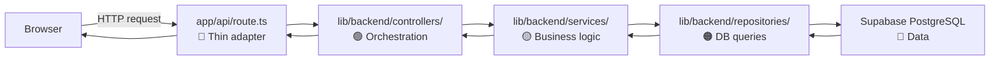
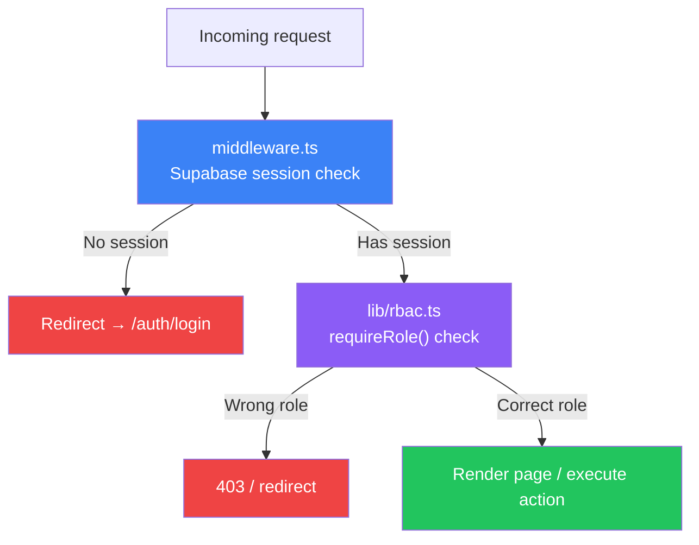
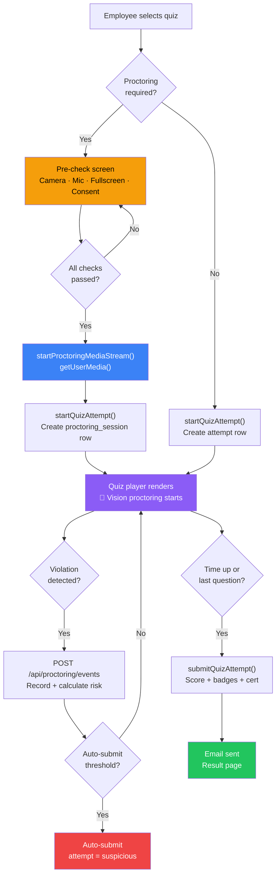
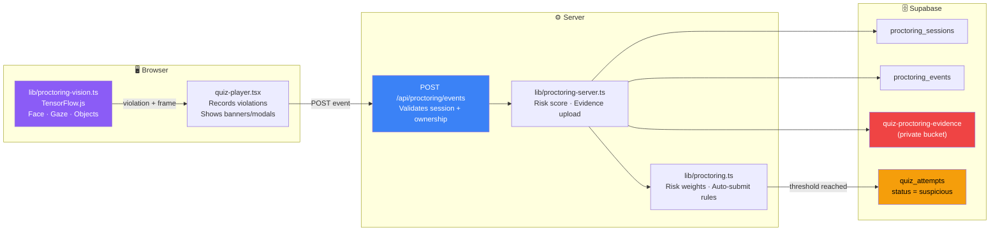
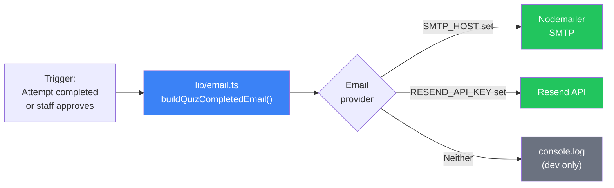
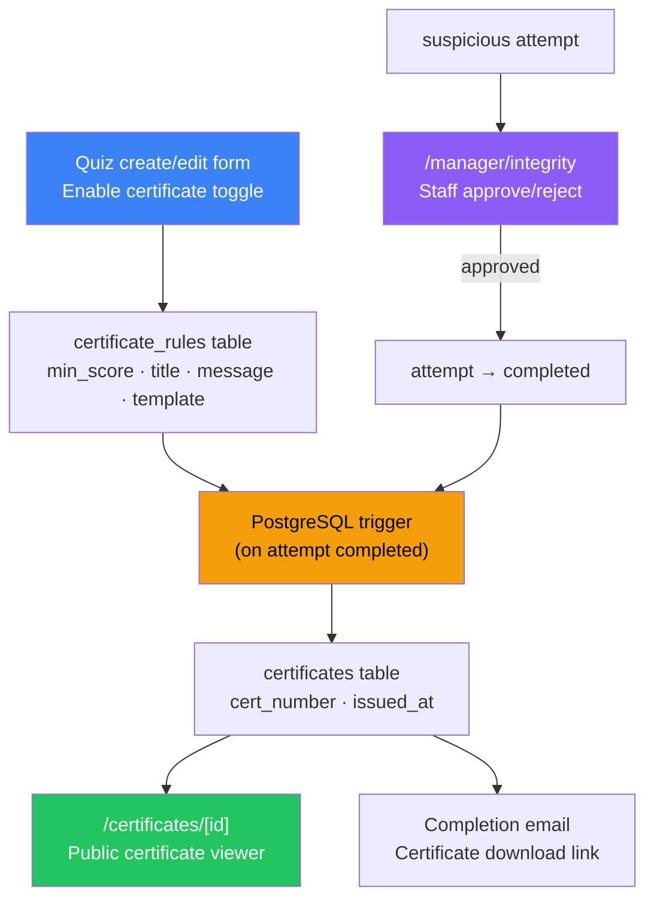

# Architecture

SkillTest_AI is a **Next.js 16 App Router** application backed by **Supabase PostgreSQL**. This document explains every layer — from browser to database — so any developer can navigate the codebase immediately.

---

## Conceptual Layers

```
┌─────────────────────────────────────────────────────────┐
│  🖥️  FRONTEND  (browser)                                │
│  app/**  ·  components/**  ·  hooks/**  ·  styles/**   │
├─────────────────────────────────────────────────────────┤
│  ⚙️  BACKEND  (Node.js / Vercel Edge)                   │
│  app/api/**  ·  lib/actions/**  ·  lib/backend/**       │
├─────────────────────────────────────────────────────────┤
│  🗄️  DATABASE  (Supabase PostgreSQL)                    │
│  database/migrations/**  ·  RLS policies  ·  Triggers  │
└─────────────────────────────────────────────────────────┘
```

---

## Folder Map

```
SkillTest_AI/
│
├── 📂 app/                        ← Next.js App Router
│   ├── 📂 api/                    ← REST API route handlers
│   │   ├── ai-chat/               ← AI coaching chat
│   │   ├── ai-insight/            ← Manager insights
│   │   ├── ai-recommend/          ← Learner recommendations
│   │   ├── ai-status/             ← AI provider health
│   │   ├── assessment-import/     ← Score import endpoint
│   │   ├── certificates/          ← Certificate generation
│   │   ├── cron/training-governance/ ← Scheduled governance
│   │   ├── employees/             ← Employee data API
│   │   ├── export/                ← Excel/PDF export endpoints
│   │   ├── leaderboard/           ← Leaderboard data
│   │   ├── manager-chatbot/       ← Command chatbot
│   │   ├── proctoring/events/     ← Live proctoring event sink
│   │   └── training/              ← Training operations API
│   │
│   ├── 📂 auth/                   ← Login, sign-up, reset, callback
│   ├── 📂 employee/               ← Employee workspace pages
│   │   ├── badges/
│   │   ├── leaderboard/
│   │   ├── quizzes/[quizId]/      ← Quiz player + results
│   │   ├── training/
│   │   └── profile/
│   │
│   ├── 📂 manager/                ← Manager / Admin workspace
│   │   ├── admin/                 ← Admin console
│   │   ├── analytics/             ← AI-powered dashboards
│   │   ├── compliance/            ← BRD evidence pack
│   │   ├── employees/             ← Employee management
│   │   ├── integrity/             ← Proctoring review center
│   │   ├── operations/            ← Training batch management
│   │   ├── quizzes/               ← Quiz CRUD
│   │   ├── reports/               ← Report downloads
│   │   └── settings/
│   │
│   ├── 📂 certificates/           ← Public certificate viewer
│   ├── 📂 profiles/               ← Public profile pages
│   └── 📂 demo/                   ← Demo / preview routes
│
├── 📂 components/                 ← Reusable React components
│   ├── 📂 ui/                     ← Base shadcn/Radix components
│   ├── 📂 manager/                ← Manager-specific widgets
│   ├── 📂 employee/               ← Employee-specific widgets
│   ├── 📂 avatar/                 ← 3D avatar renderer & picker
│   ├── 📂 certificates/           ← Certificate card & viewer
│   ├── 📂 insights/               ← Readiness meter, orb
│   ├── 📂 landing/                ← Public landing page sections
│   ├── 📂 navigation/             ← Nav bars and sidebars
│   ├── 📂 profile/                ← Profile dashboard widgets
│   └── 📂 quiz/                   ← Quiz display components
│
├── 📂 lib/                        ← Business logic & utilities
│   ├── 📂 actions/                ← Next.js server actions
│   │   ├── auth.ts                ← Sign-in, sign-up, reset
│   │   ├── employee.ts            ← Quiz attempt, submission
│   │   ├── manager.ts             ← Employee import, assignment
│   │   ├── profile.ts             ← Profile reads/updates
│   │   ├── quiz.ts                ← Quiz CRUD actions
│   │   └── training.ts            ← Batch/session actions
│   │
│   ├── 📂 backend/                ← Layered backend services
│   │   ├── 📂 controllers/        ← Route orchestration
│   │   ├── 📂 services/           ← Business rules, calculations
│   │   ├── 📂 repositories/       ← Database query functions
│   │   ├── 📂 database/           ← Supabase client factory
│   │   └── 📂 entities/           ← Backend type definitions
│   │
│   ├── 📂 security/               ← Zod validation, rate limiting
│   ├── 📂 supabase/               ← Client/server Supabase helpers
│   ├── 📂 types/                  ← Shared TypeScript types
│   ├── ai.ts                      ← OpenAI / Groq / Gemini selector
│   ├── email.ts                   ← SMTP / Resend email builder
│   ├── proctoring.ts              ← Risk weights, severity levels
│   ├── proctoring-server.ts       ← Server-side session & evidence
│   ├── proctoring-vision.ts       ← Browser TensorFlow vision
│   ├── rbac.ts                    ← Role access checks
│   ├── insights.ts                ← Readiness / retention logic
│   └── utils.ts                   ← Shared helpers
│
├── 📂 database/                   ← All database files
│   ├── 📂 migrations/             ← 001-048 SQL schema files
│   ├── 📂 seeds/                  ← Seed data & fixture generators
│   └── 📂 fixes/                  ← One-off applied patches
│
├── 📂 docs/                       ← Developer documentation
│   ├── ARCHITECTURE.md            ← This file
│   ├── SETUP.md                   ← Local setup guide
│   ├── TECHNICAL_OVERVIEW.md      ← Full technical reference
│   ├── PROCTORING.md              ← AI proctoring deep-dive
│   └── PRESENTATION.md            ← Presentation notes
│
├── 📂 hooks/                      ← Custom React hooks
├── 📂 public/                     ← Static assets & import templates
│   └── 📂 templates/              ← CSV/TXT/XLSX import templates
├── 📂 styles/                     ← Global CSS
└── README.md                      ← Project overview
```

---

## Backend Request Flow

Every request follows this path:



**Rule:** Routes contain no business logic. Services contain no direct DB calls. Keep each layer thin.

### Current Exceptions (fast-moving modules)

| Module | Why it skips layers |
|--------|-------------------|
| `lib/actions/manager.ts` | Form-driven mutations with Next.js server actions |
| `lib/actions/profile.ts` | Authenticated profile reads |
| `app/api/manager-chatbot/route.ts` | Compact DB context for AI fallback |
| `app/api/proctoring/events/route.ts` | Latency-sensitive live event sink |

---

## Authentication & RBAC Flow



### Roles

| 🔴 Admin | 🟠 Manager | 🟡 Training Coordinator | 🟢 Trainer | 🔵 Employee |
|----------|-----------|------------------------|-----------|------------|
| Full platform | Manager workspace | Training operations | Assigned batches | Learner workspace |

---

## Quiz Attempt Flow



---

## AI Proctoring Architecture



**Violation cooldowns** (prevent alert flooding):

| Violation | Cooldown |
|-----------|---------|
| `multiple_faces` | 4 s |
| `no_face` | 5 s |
| `gaze_down` / `gaze_away` | 10 s |
| `phone_detected` / `electronic_device` | 8 s |
| Default | 12 s |

---

## Email Flow



---

## Certificate Architecture



---

## Data Model (Key Tables)

```
profiles          → id, email, full_name, role, domain
quizzes           → id, title, topic, difficulty, passing_score, proctoring_required
quiz_questions    → id, quiz_id, question_text, options[], correct_option
quiz_assignments  → id, quiz_id, user_id, assigned_at
quiz_attempts     → id, quiz_id, user_id, score, status, proctoring_data
certificates      → id, quiz_id, user_id, cert_number, issued_at
certificate_rules → id, quiz_id, min_score, title, message, template_url
user_badges       → id, user_id, badge_id, earned_at
training_batches  → id, name, domain, start_date, lead_trainer_id
batch_learners    → id, batch_id, user_id
proctoring_sessions → id, attempt_id, started_at, risk_score
proctoring_events → id, session_id, type, label, occurred_at, evidence_url
```
